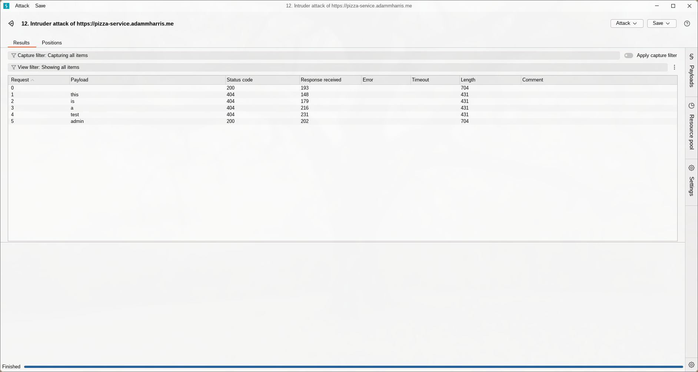
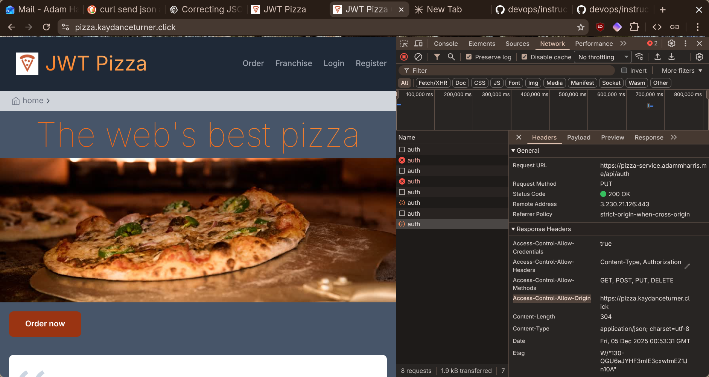
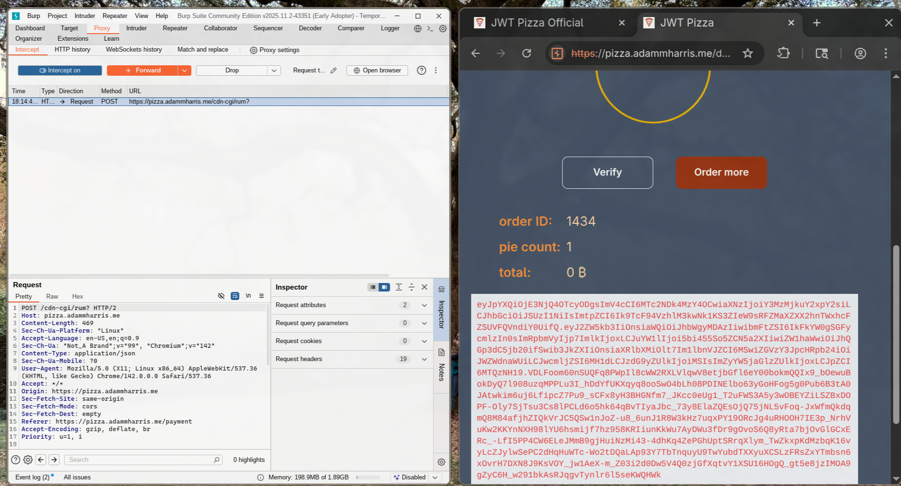
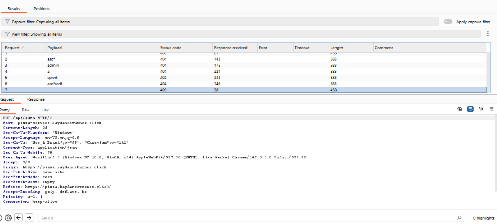
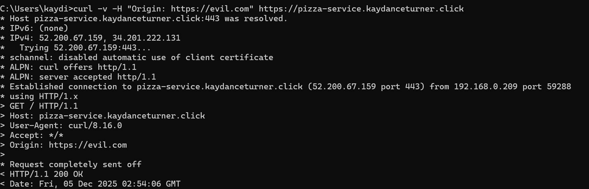
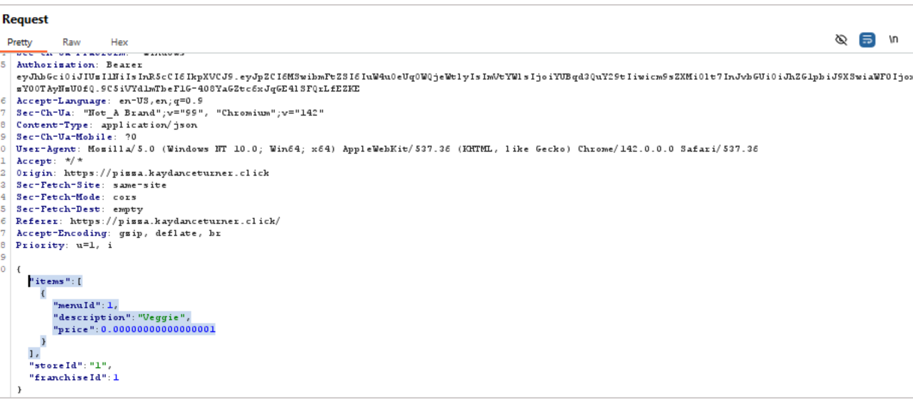

## Peer Test - Adam Harris and Kaydance Turner

### Self Attack - Adam Harris
I found that my pizza service was vulnerable in several ways:

 **Password Brute Force**
 
*Date*: 2025-12-04

*Target*: https://pizza-service.adammharris.me

*Classification*: Identification and Authentication Failures

*Severity*: 3 (High)

*Description*: The pizza service's rate limits are lacking. I can send 1000+ requests without being turned down, making password brute forces relatively simple. The admin account a@jwt.com has a default password.

*Correction*: Introduce rate limits. Change default password.



**Misconfigured CORS**

*Date*: 2025-12-04

*Target*: https://pizza-service.adammharris.me

*Classification*: Broken Access Control

*Severity*: 2 (Medium)

*Description*: CORS does not work. I was able to login from a different origin. The response included `access-control-allow-credentials: true` and `access-control-allow-origin: <the invalid origin I used>`.

*Correction*: Fix CORS; only allow https://pizza.adammharris.me




**HTTP Request interception**

*Date*: 2025-12-04

*Target*: https://pizza-service.adammharris.me

*Classification*: Injection

*Severity*: 3 (High)

*Description*: Using Burp Suite, I can buy a pizza for 0 BTC via HTTP request interception. The service does not double check the price.

*Correction*: Don't send the price as part of the request at all—prices should be read-only.



### Self Attack - Kaydance Turner

**Password Brute Force**

*Date*: 2025-12-04

*Target*: https://pizza-service.kaydanceturner.click

*Classification*: Identification and Authentication Failures

*Severity*: 3 (High)

*Description*: The admin, diner, and franchisee accounts all have default passwords which are just the role, making brute force password injection very easy. I also don't even have to guess the password since making it blank lets me in as well. 

*Correction*: Change default password. Modify backend code to not accept empty passwords.



**Misconfigured CORS**

*Date*: 2025-12-04

*Target*: https://pizza-service.kaydanceturner.click

*Classification*: Broken Access Control

*Severity*: 2 (Medium)

*Description*: Currently any website can access my api. I tested this using `curl -v -H "Origin: https://evil.com" https://pizza-service.kaydanceturner.click` and I got a 200 response back.

*Correction*: Create a whitelist of websites which are allowed to access my api; only allow https://pizza.kaydanceturner.click and local dev.



**HTTP Request interception**

*Date*: 2025-12-04

*Target*: https://pizza-service.adammharris.me

*Classification*: Injection

*Severity*: 3 (High)

*Description*: Using Burp Suite, I can buy a pizza for 0 BTC via HTTP request interception. The service does not double check the price.

*Correction*: Don't send the price as part of the request at all—prices should be read-only.



### Peer Attack - Adam Harris

In my testing, I tried the following command in the JavaScript console:

```javascript
fetch("https://pizza-service.kaydanceturner.click/api/auth", {
  method: "PUT",
  headers: {
    "Content-Type": "application/json"
  },
  body: JSON.stringify({ email: "a@jwt.com", password: "admin#" })
})
```

It returned a response indicating that CORS was indeed configured correctly:
```
  Access to fetch at 'https://pizza-service.kaydanceturner.click/api/auth' from origin 'https://pizza.adammharris.me' has been blocked by CORS policy: Response to preflight request doesn't pass access control check: No 'Access-Control-Allow-Origin' header is present on the requested resource.
```

With the proper origin (`https://pizza.kaydanceturner.click`) it worked correctly.

I also tried to brute force a password and discovered a quirk in Burp Suite: it behaves strangely with `#` characters. There did not seem to be rate limits, so:

**Password Brute Force**

*Date*: 2025-12-04

*Target*: https://pizza-service.kaydanceturner.click

*Classification*: Identification and Authentication Failures

*Severity*: 3 (High)

*Description*: The pizza service's rate limits are lacking. I can send 100+ requests in a short time period, making password brute forces relatively simple. The admin account a@jwt.com has a relatively simple password.

*Correction*: Introduce rate limits. Change to a stronger password.

I tested request interception by attempting to purchase a pizza for 0 BTC, but it didn't work. So that is good security!

Overall, the main recommendations I can make are rate limits and changing to a stronger password for the admin account.

### Peer Attack - Kaydance Turner

**Password Brute Force**

*Date*: 2025-12-04

*Target*: https://pizza-service.adammharris.me

*Classification*: Identification and Authentication Failures

*Severity*: 3 (High)

*Description*: I typed in "admin" for the password to a@jwt.com and got in. He forgot to change his password! I can now remove all of the franchisess and completely ruin his business.

*Correction*: He should change his admin password to something more difficult to guess.

**HTTP Request interception**

*Date*: 2025-12-04

*Target*: https://pizza-service.adammharris.me

*Classification*: Injection

*Severity*: 3 (High)

*Description*: I intercepted the pizza order request in burp suite and replaced the price with .000001 bitcoin. I can now buy his pizza for super cheap.

*Correction*: Don't send the price as part of the request at all—prices should be read-only.

**Misconfigured CORS**

*Date*: 2025-12-04

*Target*: https://pizza-service.adammharris.me

*Classification*: Broken Access Control

*Severity*: 2 (Medium)

*Description*: I used curl to send `curl -v -H "Origin: https://evil.com" https://pizza-service.adammharris.me` to his site and got a 200 response back. However, this didn't work for everything. When I sent a bad requests to /api/menu/order, it didn't allow give me a response.

*Correction*: Create a whitelist of websites which are allowed to access his api.

### Summary

We were both able to penetrate each others websites with curl requests from unknown sites and were also able to figure out each other's admin passwords. This shows that we still had much more to do to be able to fully harden our websites. Considering how we were able to penetrate each other's websites, and we're just simple CS students, it just shows how important it is to put time and effort into keeping our site secure against attackers.

Penetration testing helped us learn the importance of protecting against brute force attacks, injection attacks, and CORS vulnerabilities.
